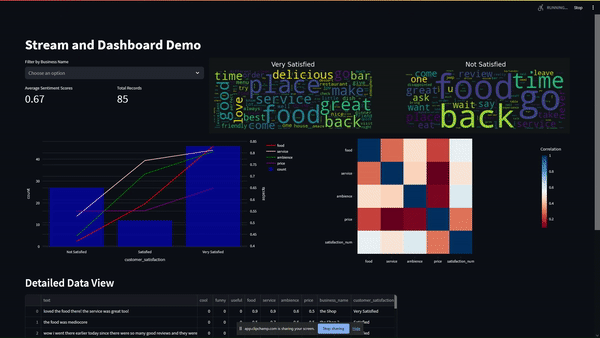
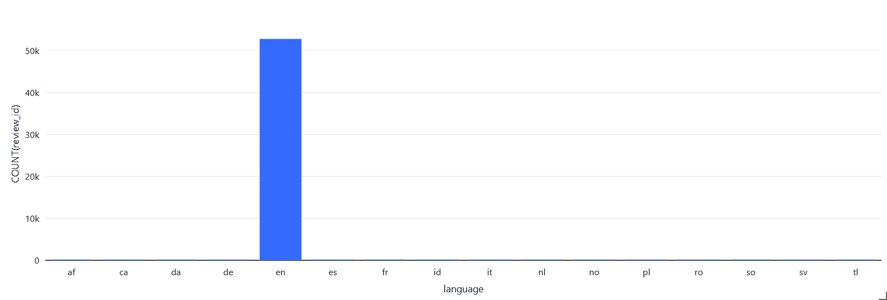
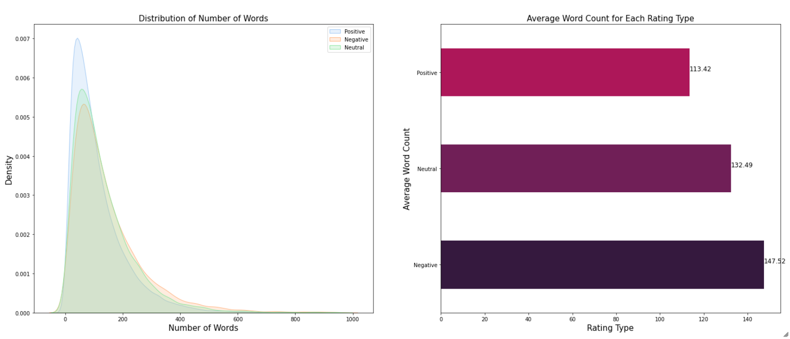
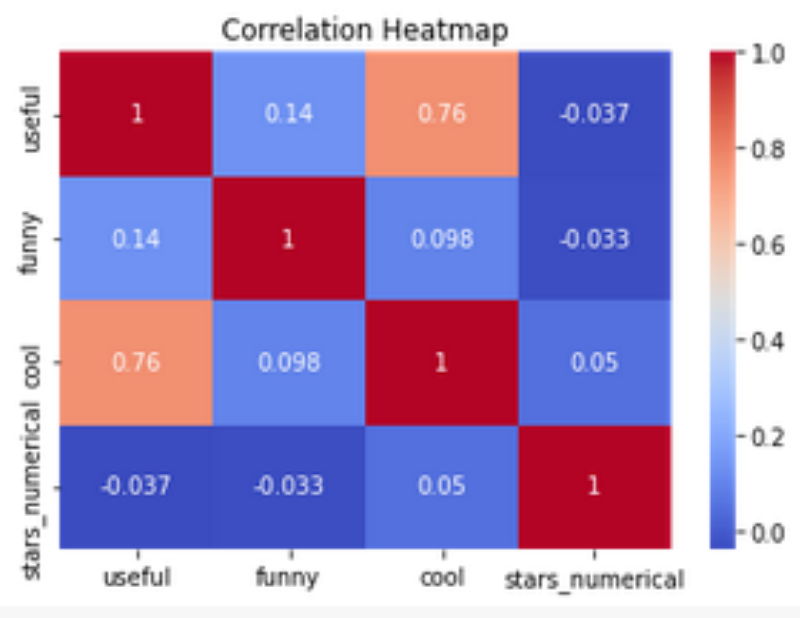
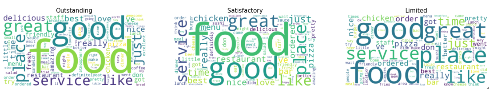
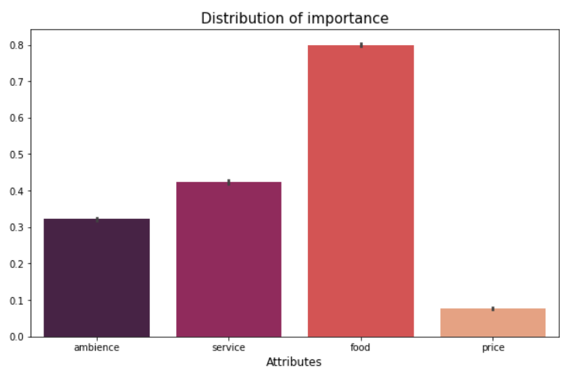
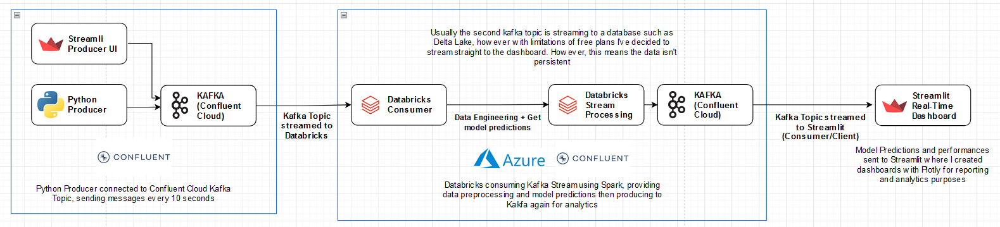

# Yelp AI-Driven Real-Time Dashboard

Building a Machine Learning Model to predict customer satisfaction levels of Restaurant Businesses using Yelp's open dataset. From Data to Real-Time Insights with Databricks, Spark, Scikit-learn, Confluent Cloud Kafka and Streamlit.

Date: August 2023 
Data: https://www.yelp.com/dataset

Here's a quick demo of the resulting dashboard. The "customer_satisfaction" column is generated with the Machine Learning Model I've developed, along with generated attribute columns such as "food", "service", "ambience" and "price". The dashboard is built with Streamlit and Plotly. 

### Table of Contents
1. [Introduction](#introduction)
2. [Developing the Model](#developing-the-model)
    1. [Exploratory Data Analysis](#exploratory-data-analysis)
    2. [Model Development](#model-development)
3. [Architecture](#architecture)
4. [Real-Time Dashboard](#real-time-dashboard)

### Introduction
This project was built for restaurant businesses to leverage AI and Big Data Technologies to provide more data-driven recommendations to businesses to better understand what consumers are looking for. With the hypothesis that: Restaurants that possess certain attributes, such as high-quality food, excellent customer service, appealing ambiance, and price, are more likely to thrive as consumer favourites.

### Developing the Model

Loaded in the processed datasets into Databricks dbfs, then with spark.read.csv() and toPandas() to load it into a dataframe.

#### Exploratory Data Analysis

Through Exploratory Data Analysis, here's an overview of what I found.

Many of the text were in different languages. Non-english text serve as noise to the model as it is not trained to understand other languages. I then filtered out the non-english text using langdetect.

Expectedly, we see that as people disappointed with the business tend to write more about it and their bad experiences. This is a good indicator for the model to learn from.

There is a weak negative correlation between "usefulness" and "star ratings," suggesting that as reviews are perceived as more useful, the star rating tends to be lower. This might be because users are more likely to rate a review as useful when it's negative and serves as a warning not to visit the restaurant. 

Interestingly, "place" is a lot bigger in the limited class in relation with the rest of the words as compared in the outstanding and satisfactory class, this could mean that place/atmosphere/ambience is an important aspect. "food", "place", "service" and "time" seem to be important across all as well.

Based on the extracted attributes with TextBlob (Method 1), I then merged a few categories such as food categories like "wings" and "pizza". These were the attributes that most reviews talked about.

#### Model Development
I then started the model development process, here's an overview of what I did.

### Architecture

I’ve put together a diagram to better illustrate the pipeline I’ve set up. There were limitations around not being able to have a database that supports real time (using PostgreSQL). There are 2 Python Producers to produce the stream, mimicking when a user submits a review into yelp or when our web scraper scrapes a new record every 10s. The python script is just a producer producing from unseen and unprocessed data and the Streamlit demo looks like this, where we can also submit our own reviews to be classified.

The code is available in the `app.py`, the producer application and the `app_dashboard.py` the dashboard/consumer application.

### Real-Time Dashboard
Here's a full demo of the stream and how it looks like when a new entry is produced and classified.

<i>Might want to change the playback speed of the video to slow it down. The video was filmed for a presentation.</i>

<iframe src="https://player.vimeo.com/video/873609642?h=19637177fd" width="640" height="360" frameborder="0" allow="autoplay; fullscreen; picture-in-picture" allowfullscreen></iframe>

So I first imported the libraries and the functions that I need within databricks. Then ,I loaded in my model and created a `prediction()` function.

We see that I'm listening to a Kafka topic on Confluent Cloud. We will produce data from the producer application on the left. Here's what it looks like with 1 record streaming. Once the data is streamed and processed, we will see the five new columns added, which we can then also see on the dashboard in real time.

Now, let's enter our own review! Let's say that we loved the place, food and service, give it a business name. Once the data is processed and classified, we see it in the dashboard once again with food, service and ambience having high scores while price takes the mean as its not mentioned.

We can also see how this looks in Confluent Cloud with 2 Kafka topics where 1 has the unprocessed one and the other has the processed data with more columns and the predicted column.

### Contact
Jolene - [jolenechong7@gmail.com](mailto:jolenechong7@gmail.com)  